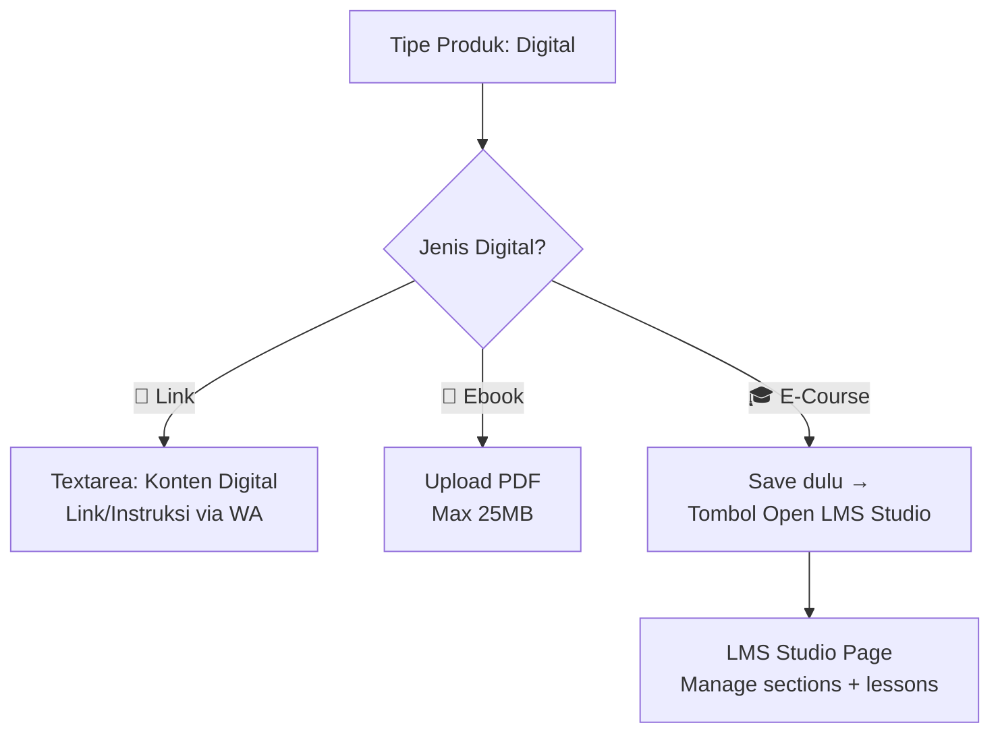

# Fitur Ebook + LMS E-Course untuk WA Market

Dua fitur besar yang ditambahkan sebagai **ekstensi dari tipe produk Digital yang sudah ada**:
- **Digital > Link**: Perilaku lama — link/instruksi dikirim via WhatsApp (sudah ada)
- **Digital > Ebook**: PDF reader in-browser dengan watermarking
- **Digital > E-Course**: LMS video YouTube per bab dengan progress tracking

---

## Keputusan Desain

| Keputusan | Nilai |
|-----------|-------|
| Product type | **Tetap `digital`** — ditambah kolom `digitalType` (`link` / `ebook` / `course`) |
| Format ebook | **PDF only**, max 25MB |
| Watermarking | **Ya** — CSS overlay (nama + HP pembeli) |
| Bahasa UI | **Mixed** (Indonesia + English) |
| Video source | **YouTube** — admin paste URL, embed di player |
| LMS pattern | **Scalev.id style** admin → **Haimasday style** student |

> [!IMPORTANT]
> **Perubahan arsitektur**: LMS dan Ebook **bukan** product type baru. Mereka adalah sub-tipe dari `digital`. Kolom baru `digital_type` pada tabel `products` menentukan behavior:
> - `link` → existing (kirim link via WA, default untuk backward compat)
> - `ebook` → PDF upload + reader
> - `course` → LMS curriculum + video player

---

## Proposed Changes

### Komponen 1: Database Schema

#### [MODIFY] [schema.ts](file:///c:/Aplikasi/wamarket/apps/api/src/db/schema.ts)

**Kolom baru pada tabel `products`:**
```typescript
digitalType: text('digital_type').default('link'),  // 'link' | 'ebook' | 'course'
ebookFileKey: text('ebook_file_key'),               // R2 key: "ebooks/uuid.pdf"
```

> Existing digital products otomatis `digitalType = 'link'` (default value), jadi **backward compatible**.

**6 tabel baru:**

```typescript
// ============================================
// EBOOK PURCHASES TABLE
// ============================================
export const ebookPurchases = sqliteTable('ebook_purchases', {
    id: text('id').primaryKey().$defaultFn(generateId),
    storeId: text('store_id').references(() => stores.id, { onDelete: 'cascade' }).notNull(),
    userId: text('user_id').references(() => users.id, { onDelete: 'cascade' }).notNull(),
    productId: text('product_id').references(() => products.id, { onDelete: 'cascade' }).notNull(),
    orderId: text('order_id').references(() => orders.id, { onDelete: 'cascade' }).notNull(),
    purchasedAt: integer('purchased_at', { mode: 'timestamp' }).$defaultFn(now),
    lastReadAt: integer('last_read_at', { mode: 'timestamp' }),
    lastPage: integer('last_page').default(0),
    totalPages: integer('total_pages').default(0),
}, (table) => ({
    unqUserProduct: unique().on(table.userId, table.productId),
}));

// ============================================
// COURSE SECTIONS TABLE (Bab/Chapter)
// ============================================
export const courseSections = sqliteTable('course_sections', {
    id: text('id').primaryKey().$defaultFn(generateId),
    productId: text('product_id').references(() => products.id, { onDelete: 'cascade' }).notNull(),
    title: text('title').notNull(),
    sortOrder: integer('sort_order').default(0),
    isVisible: integer('is_visible', { mode: 'boolean' }).default(true),
    createdAt: integer('created_at', { mode: 'timestamp' }).$defaultFn(now),
});

// ============================================
// COURSE LESSONS TABLE (Materi per Section)
// ============================================
export const courseLessons = sqliteTable('course_lessons', {
    id: text('id').primaryKey().$defaultFn(generateId),
    sectionId: text('section_id').references(() => courseSections.id, { onDelete: 'cascade' }).notNull(),
    title: text('title').notNull(),
    type: text('type').notNull().default('video'),  // 'video' | 'text' | 'audio'
    videoUrl: text('video_url'),                     // YouTube URL
    audioUrl: text('audio_url'),
    content: text('content'),                        // Rich text HTML
    duration: text('duration'),                      // "09:08"
    sortOrder: integer('sort_order').default(0),
    isVisible: integer('is_visible', { mode: 'boolean' }).default(true),
    isFreePreview: integer('is_free_preview', { mode: 'boolean' }).default(false),
    createdAt: integer('created_at', { mode: 'timestamp' }).$defaultFn(now),
});

// ============================================
// COURSE ENROLLMENTS TABLE
// ============================================
export const courseEnrollments = sqliteTable('course_enrollments', {
    id: text('id').primaryKey().$defaultFn(generateId),
    storeId: text('store_id').references(() => stores.id, { onDelete: 'cascade' }).notNull(),
    userId: text('user_id').references(() => users.id, { onDelete: 'cascade' }).notNull(),
    productId: text('product_id').references(() => products.id, { onDelete: 'cascade' }).notNull(),
    orderId: text('order_id').references(() => orders.id, { onDelete: 'cascade' }).notNull(),
    enrolledAt: integer('enrolled_at', { mode: 'timestamp' }).$defaultFn(now),
    completedAt: integer('completed_at', { mode: 'timestamp' }),
}, (table) => ({
    unqUserProduct: unique().on(table.userId, table.productId),
}));

// ============================================
// LESSON COMPLETIONS TABLE
// ============================================
export const lessonCompletions = sqliteTable('lesson_completions', {
    id: text('id').primaryKey().$defaultFn(generateId),
    enrollmentId: text('enrollment_id').references(() => courseEnrollments.id, { onDelete: 'cascade' }).notNull(),
    lessonId: text('lesson_id').references(() => courseLessons.id, { onDelete: 'cascade' }).notNull(),
    completedAt: integer('completed_at', { mode: 'timestamp' }).$defaultFn(now),
}, (table) => ({
    unqEnrollLesson: unique().on(table.enrollmentId, table.lessonId),
}));
```

---

### Komponen 2: Backend — Ebook API

#### [NEW] [ebooks.ts](file:///c:/Aplikasi/wamarket/apps/api/src/routes/ebooks.ts)

| Method | Path | Auth | Deskripsi |
|--------|------|------|-----------|
| `GET` | `/ebooks/my-library` | Login | Daftar ebook yang dimiliki |
| `GET` | `/ebooks/:productId/read` | Login | Stream PDF dari R2 (cek ownership) |
| `PATCH` | `/ebooks/:productId/progress` | Login | Simpan halaman terakhir |
| `GET` | `/ebooks/:productId/check-access` | Optional | Cek apakah sudah beli |

#### [MODIFY] [upload.ts](file:///c:/Aplikasi/wamarket/apps/api/src/routes/upload.ts)
- Tambah `POST /api/upload/ebook` — upload PDF ke R2 prefix `ebooks/`

---

### Komponen 3: Backend — Course API

#### [NEW] [courses.ts](file:///c:/Aplikasi/wamarket/apps/api/src/routes/courses.ts)

**Admin Routes:**

| Method | Path | Deskripsi |
|--------|------|-----------|
| `GET` | `/courses/:productId/curriculum` | Ambil semua sections + lessons |
| `POST` | `/courses/:productId/sections` | Buat section baru |
| `PUT` | `/courses/sections/:sectionId` | Edit section |
| `DELETE` | `/courses/sections/:sectionId` | Hapus section + lessons |
| `PUT` | `/courses/:productId/sections/reorder` | Reorder sections |
| `POST` | `/courses/sections/:sectionId/lessons` | Buat lesson (video/text/audio) |
| `PUT` | `/courses/lessons/:lessonId` | Edit lesson |
| `DELETE` | `/courses/lessons/:lessonId` | Hapus lesson |
| `PUT` | `/courses/sections/:sectionId/lessons/reorder` | Reorder lessons |

**Student Routes:**

| Method | Path | Deskripsi |
|--------|------|-----------|
| `GET` | `/courses/my-courses` | Daftar enrolled courses + progress % |
| `GET` | `/courses/:productId/player` | Curriculum + completion status |
| `POST` | `/courses/:productId/lessons/:lessonId/complete` | Mark complete |
| `DELETE` | `/courses/:productId/lessons/:lessonId/complete` | Mark incomplete |
| `GET` | `/courses/:productId/check-access` | Cek enrollment |

---

### Komponen 4: Backend — Auto-Grant Access

#### [MODIFY] [orders.ts](file:///c:/Aplikasi/wamarket/apps/api/src/routes/orders.ts)
#### [MODIFY] [payment.ts](file:///c:/Aplikasi/wamarket/apps/api/src/routes/payment.ts)

Saat order status → `paid`/`completed`, cek items:
```typescript
// Untuk produk digital type ebook → insert ebook_purchases
if (product.productType === 'digital' && product.digitalType === 'ebook') {
    await db.insert(ebookPurchases).values({...}).onConflictDoNothing();
}
// Untuk produk digital type course → insert course_enrollments
if (product.productType === 'digital' && product.digitalType === 'course') {
    await db.insert(courseEnrollments).values({...}).onConflictDoNothing();
}
// Untuk produk digital type link → existing behavior (kirim via WA)
```

#### [MODIFY] [index.ts](file:///c:/Aplikasi/wamarket/apps/api/src/index.ts)
```typescript
import ebooksRouter from './routes/ebooks';
import coursesRouter from './routes/courses';
app.route('/api/s/:slug/ebooks', ebooksRouter);
app.route('/api/s/:slug/courses', coursesRouter);
```

---

### Komponen 5: Frontend — Admin Product Form

#### [MODIFY] [AdminProductsPage.jsx](file:///c:/Aplikasi/wamarket/apps/web/src/pages/AdminProductsPage.jsx)

Saat tipe produk = `digital`, tampilkan **sub-type selector tambahan**:

```jsx
{formData.productType === 'digital' && (
    <div>
        <label>Jenis Produk Digital *</label>
        <select value={formData.digitalType} onChange={...}>
            <option value="link">📧 Link / Instruksi (kirim via WA)</option>
            <option value="ebook">📖 Ebook (PDF Reader)</option>
            <option value="course">🎓 E-Course (LMS Video)</option>
        </select>
    </div>
)}
```

**Conditional fields berdasarkan `digitalType`:**

| digitalType | Fields yang muncul |
|-------------|-------------------|
| `link` | Textarea "Konten Digital" (existing) |
| `ebook` | File picker upload PDF + nama file preview |
| `course` | Tombol "🎬 Open LMS Studio" (setelah produk disave) |

---

### Komponen 6: Frontend — Admin LMS Studio (BARU)

#### [NEW] [AdminLMSStudioPage.jsx](file:///c:/Aplikasi/wamarket/apps/web/src/pages/AdminLMSStudioPage.jsx)

Full-screen page untuk manage curriculum. Diakses dari admin `/admin/lms-studio/:productId`.

**Layout (Scalev.id style):**
```
┌────────────────────────────────────────────────────────────┐
│ ✕ Close    LMS Studio · Nama Course              Save All  │
├──────────────────┬─────────────────────────────────────────┤
│ Contents         │                                         │
│                  │  Sesi I                                 │
│ 📁 Modul 1    🔵↕│  ┌─────────────────────────────────┐   │
│   📹 Sesi I   🔵 │  │   YouTube Video Embed           │   │
│   📹 Sesi II  🔵 │  │   (preview dari URL)            │   │
│   + New Module   │  └─────────────────────────────────┘   │
│                  │                                         │
│ 📁 Bonus      🔵↕│  Video URL: [https://youtu.be/xxx  ]   │
│   📄 Worksheet 🔵│  Duration:  [09:08                 ]   │
│   + New Module   │                                         │
│                  │  ┌─ Rich Text Editor ──────────────┐   │
│ + Create Section │  │ B I U  Link  Image  ...          │   │
│                  │  │ Catatan, link download, dll      │   │
│                  │  └──────────────────────────────────┘   │
│                  │                                         │
│                  │  ☐ Gratis Preview    [Save Module]      │
└──────────────────┴─────────────────────────────────────────┘
```

**Fitur:**
- Sections: CRUD + toggle visibility + reorder
- Lessons: CRUD + tipe (Video/Text/Audio) + toggle visibility
- Video: paste YouTube URL → auto-preview embed
- Audio: paste URL audio → `<audio>` preview
- Rich text editor di bawah media untuk catatan/link
- Duration input manual
- Free Preview toggle per lesson
- "Create New Module" modal: Module Name + Module Type dropdown

---

### Komponen 7: Frontend — Storefront Product Detail

#### [MODIFY] [ProductDetailPage.jsx](file:///c:/Aplikasi/wamarket/apps/web/src/pages/ProductDetailPage.jsx)

Badge dan tombol aksi berdasarkan `digitalType`:

```jsx
{product.productType === 'digital' && product.digitalType === 'ebook' && (
    <div className="badge bg-purple-50 text-purple-700">
        📖 E-Book — Baca langsung di browser setelah pembelian.
    </div>
)}

{product.productType === 'digital' && product.digitalType === 'course' && (
    <div className="badge bg-emerald-50 text-emerald-700">
        🎓 E-Course — Akses materi video selamanya setelah pembelian.
    </div>
)}
```

**Tombol:**
- Ebook (punya akses) → "📖 Baca Ebook" → `/ebook/:productId`
- Course (enrolled) → "🎓 Masuk Kelas" → `/course/:productId`
- Belum beli → "🛒 Beli" → add to cart

**Info course** di deskripsi:
- "📹 12 video materi • ⏱️ 2j 30m • 📑 3 modul"

---

### Komponen 8: Frontend — Ebook Reader (BARU)

#### [NEW] [EbookReaderPage.jsx](file:///c:/Aplikasi/wamarket/apps/web/src/pages/EbookReaderPage.jsx)

Full-screen PDF reader menggunakan **react-pdf**.

```
┌──────────────────────────────────────────────┐
│  ← Library    📖 Judul Ebook    ☾ 🔍        │
│                                              │
│          ┌────────────────────┐               │
│          │    PDF Page        │               │
│          │    Content         │               │
│          │                    │               │
│          │  ─── Watermark ─── │               │
│          │  🔒 Milik: Ahmad   │               │
│          │     0812xxxxx      │               │
│          └────────────────────┘               │
│                                              │
│    ◀ Prev      Page 5 / 120      Next ▶      │
│    ▓▓▓▓▓▓▓▓▓░░░░░░░░░░░░░░░  4%             │
└──────────────────────────────────────────────┘
```

Fitur: PDF page rendering, navigasi, zoom, dark mode, CSS watermark, progress auto-save, mobile swipe.

---

### Komponen 9: Frontend — Course Player (BARU)

#### [NEW] [CoursePlayerPage.jsx](file:///c:/Aplikasi/wamarket/apps/web/src/pages/CoursePlayerPage.jsx)

Full-screen course player. **Haimasday.com style.**

```
┌──────────────────────────────────────────────────────────────┐
│ ←    📖 Nama Course                        User ⓘ     ✕    │
├──────────────┬───────────────────────────────────────────────┤
│ MODUL 1   ⓥ↕│  Apa itu produk digital?                     │
│  ✅ Sesi 1 📹│  Last updated: 22 Jun 2025                   │
│  ✅ Sesi 2 📹│                                               │
│  ⬚ Sesi 3 📹│  ┌───────────────────────────────────────┐    │
│  ⬚ Sesi 4 📹│  │     ▶  YouTube Video Player            │    │
│              │  └───────────────────────────────────────┘    │
│ BONUS     ⓥ↕│                                               │
│  ✅ Ebook  📄│  Deskripsi / catatan / link download          │
│              │                                               │
│              │  ┌───────────────────────────────────────┐    │
│              │  │     Mark as Complete    ✓              │    │
│              │  └───────────────────────────────────────┘    │
│              │  ‹‹ Previous              Next ››            │
└──────────────┴───────────────────────────────────────────────┘
```

Fitur: Sidebar accordion dengan checkmarks, YouTube iframe embed, "Mark as Complete"/"Mark as Incomplete" toggle, Previous/Next, progress bar header, mobile responsive (sidebar toggle).

---

### Komponen 10: Frontend — My Library & My Courses (BARU)

#### [NEW] [MyLibraryPage.jsx](file:///c:/Aplikasi/wamarket/apps/web/src/pages/MyLibraryPage.jsx)
Grid ebook yang dimiliki + progress bar + "Baca" button.

#### [NEW] [MyCoursesPage.jsx](file:///c:/Aplikasi/wamarket/apps/web/src/pages/MyCoursesPage.jsx)
Grid course yang di-enroll + progress % + "Lanjut Belajar" button.

---

### Komponen 11: Frontend — Routing & Navigation

#### [MODIFY] [App.jsx](file:///c:/Aplikasi/wamarket/apps/web/src/App.jsx)

New routes:
- `/my-library` → MyLibraryPage (protected)
- `/my-courses` → MyCoursesPage (protected)
- `/ebook/:productId` → EbookReaderPage (protected)
- `/course/:productId` → CoursePlayerPage (protected)
- `/admin/lms-studio/:productId` → AdminLMSStudioPage (admin only)

Navigation: "📚 Perpustakaan" + "🎓 Kelas Saya" di menu customer.

---

### Komponen 12: Frontend — API Client & Hooks

#### [MODIFY] [client.js](file:///c:/Aplikasi/wamarket/apps/web/src/api/client.js)

```js
export const ebooksApi = {
    getMyLibrary: () => api.get('/ebooks/my-library'),
    checkAccess: (productId) => api.get(`/ebooks/${productId}/check-access`),
    getReadUrl: (productId) => {
        const token = localStorage.getItem('auth_token');
        return `${API_BASE_URL}/s/${currentStoreSlug}/ebooks/${productId}/read?token=${token}`;
    },
    saveProgress: (productId, page, totalPages) => 
        api.patch(`/ebooks/${productId}/progress`, { page, totalPages }),
    uploadEbook: (file) => {
        const formData = new FormData();
        formData.append('ebook', file);
        return api.post('/upload/ebook', formData, { 
            headers: { 'Content-Type': 'multipart/form-data' } 
        });
    },
};

export const coursesApi = {
    // Admin
    getCurriculum: (productId) => api.get(`/courses/${productId}/curriculum`),
    createSection: (productId, data) => api.post(`/courses/${productId}/sections`, data),
    updateSection: (sectionId, data) => api.put(`/courses/sections/${sectionId}`, data),
    deleteSection: (sectionId) => api.delete(`/courses/sections/${sectionId}`),
    reorderSections: (productId, order) => api.put(`/courses/${productId}/sections/reorder`, { order }),
    createLesson: (sectionId, data) => api.post(`/courses/sections/${sectionId}/lessons`, data),
    updateLesson: (lessonId, data) => api.put(`/courses/lessons/${lessonId}`, data),
    deleteLesson: (lessonId) => api.delete(`/courses/lessons/${lessonId}`),
    reorderLessons: (sectionId, order) => api.put(`/courses/sections/${sectionId}/lessons/reorder`, { order }),
    // Student
    getMyCourses: () => api.get('/courses/my-courses'),
    getPlayer: (productId) => api.get(`/courses/${productId}/player`),
    checkAccess: (productId) => api.get(`/courses/${productId}/check-access`),
    markComplete: (productId, lessonId) => api.post(`/courses/${productId}/lessons/${lessonId}/complete`),
    markIncomplete: (productId, lessonId) => api.delete(`/courses/${productId}/lessons/${lessonId}/complete`),
};
```

#### [NEW] [useEbooks.js](file:///c:/Aplikasi/wamarket/apps/web/src/hooks/useEbooks.js)
#### [NEW] [useCourses.js](file:///c:/Aplikasi/wamarket/apps/web/src/hooks/useCourses.js)

---

### Dependencies

| Package | Where | Purpose |
|---------|-------|---------|
| `react-pdf` | `apps/web` | PDF reader untuk ebook |

No new backend dependencies needed.

---

## Ringkasan File Changes

| Status | File | Fitur |
|--------|------|-------|
| ✏️ | `apps/api/src/db/schema.ts` | +6 tabel, +2 kolom products | A+B |
| 🆕 | `apps/api/src/routes/ebooks.ts` | Ebook API | A |
| 🆕 | `apps/api/src/routes/courses.ts` | Course API | B |
| ✏️ | `apps/api/src/routes/upload.ts` | PDF upload endpoint | A |
| ✏️ | `apps/api/src/routes/orders.ts` | Auto-grant access | A+B |
| ✏️ | `apps/api/src/routes/payment.ts` | Auto-grant on callback | A+B |
| ✏️ | `apps/api/src/index.ts` | Register routes | A+B |
| 🆕 | `apps/web/src/pages/EbookReaderPage.jsx` | PDF reader | A |
| 🆕 | `apps/web/src/pages/MyLibraryPage.jsx` | Ebook library | A |
| 🆕 | `apps/web/src/pages/AdminLMSStudioPage.jsx` | LMS curriculum editor | B |
| 🆕 | `apps/web/src/pages/CoursePlayerPage.jsx` | Video course player | B |
| 🆕 | `apps/web/src/pages/MyCoursesPage.jsx` | Enrolled courses | B |
| 🆕 | `apps/web/src/hooks/useEbooks.js` | Ebook hooks | A |
| 🆕 | `apps/web/src/hooks/useCourses.js` | Course hooks | B |
| ✏️ | `apps/web/src/api/client.js` | ebooksApi + coursesApi | A+B |
| ✏️ | `apps/web/src/pages/AdminProductsPage.jsx` | digitalType selector + LMS button | A+B |
| ✏️ | `apps/web/src/pages/ProductDetailPage.jsx` | Badges + action buttons | A+B |
| ✏️ | `apps/web/src/App.jsx` | New routes | A+B |
| ✏️ | Navigation components | Menu items | A+B |

**Total: 26 files (10 new + 16 modified)**

---

## Admin Product Form Flow



---

## Verification Plan

### Automated Tests
```bash
cd apps/api
npx drizzle-kit generate
npm run db:migrate
npm run dev
```

### Manual Verification
1. **Admin**: Buat produk Digital > Ebook → upload PDF → simpan
2. **Admin**: Buat produk Digital > E-Course → save → buka LMS Studio → tambah section + lesson video
3. **Customer**: Beli ebook → login → Perpustakaan → baca PDF dengan watermark
4. **Customer**: Beli course → login → Kelas Saya → tonton video → mark complete → progress update
5. **Access Control**: Akses tanpa beli → ditolak
6. **Backward compat**: Existing digital products (type=link) tetap berfungsi normal
7. **Mobile**: Reader & player responsive
